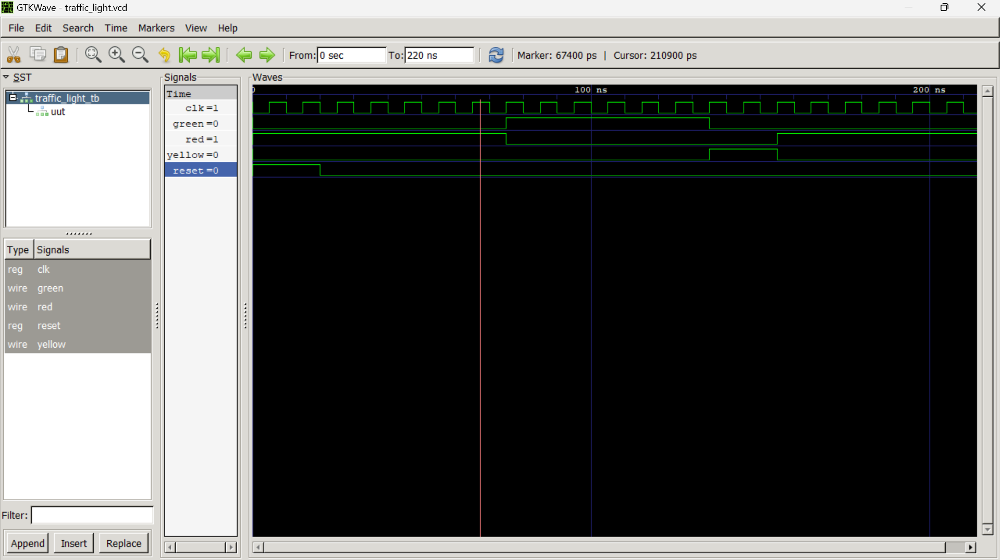

# Traffic Light Controller (FSM)

A Verilog implementation of a 3-state Traffic Light Controller 
using a Moore Finite State Machine (FSM).

## State Diagram

## Module Details

| Signal | Direction | Description          |
|--------|-----------|----------------------|
|  clk   |   Input   | Clock signal         |
|  reset |   Input   | Synchronous reset    |
|  red   |   Output  | Red light control    |
|  green |   Output  | Green light control  |
| yellow |   Output  | Yellow light control |

## Simulation Output



## How To Simulate

```bash
iverilog -o traffic_light.vvp traffic_light.v traffic_light_tb.v
vvp traffic_light.vvp
gtkwave traffic_light.vcd
```

## Key Concepts Learned
- Moore FSM design in Verilog
- Blocking vs non-blocking assignments
- Testbench writing and simulation
- GTKWave waveform analysis

## Tools Used
- Icarus Verilog
- GTKWave
- VS Code
